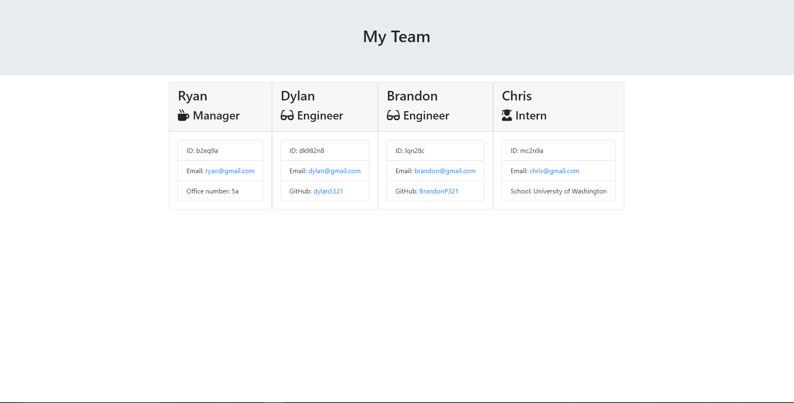

# Employee Summary Command Line Application

This is a simple command line application that allows any user to dynammically create a list of all the member's of a team that worked on a project.  That list is then parsed to create an html file with a bootstrap card for each member.  Each card contains all of the basic info for that member.

## Sample Employee Summary Page Created With App


## Demo
Here is a quick walkthrough video of the app: https://drive.google.com/file/d/1VuloEqXfoXucC1KQq9dS1mteFlQMZtcD/view

## Built With
* Bootstrap CSS framework
* path, fs, and inquirer node packages

## Installation
After cloning to local machine, run:
```
npm install
```